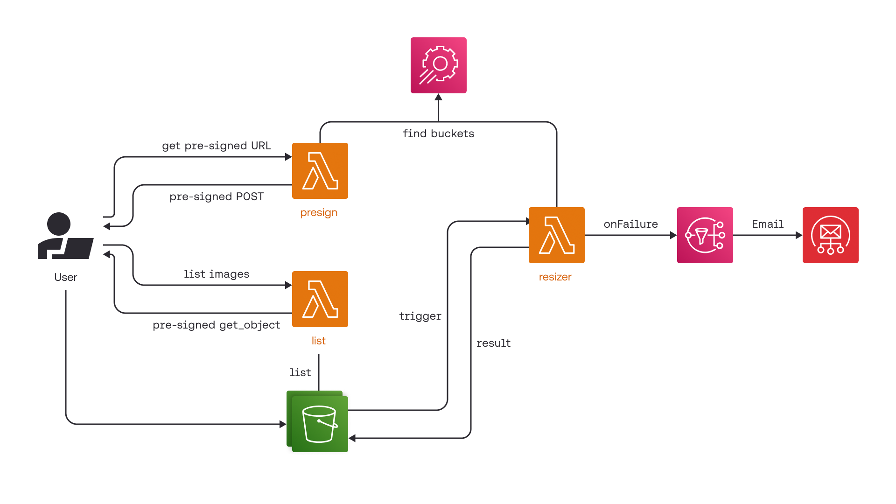

# Assignment 3 – Serverless Customer Review Processing

## Project Description

This project implements a serverless pipeline for automatic processing of customer reviews using AWS services running on MiniStack. Every review is uploaded independently to an S3 bucket, where it automatically starts a sequence of Lambda functions. The application performs text preprocessing, detects offensive language, evaluates review sentiment, and tracks users who repeatedly submit inappropriate content.

The implementation follows an event-driven architecture. Lambda functions communicate only through AWS events generated by S3 and DynamoDB rather than invoking each other directly.

The project relies on the following AWS services:

* Amazon S3 for review storage and event notifications
* AWS Lambda for serverless processing
* Amazon DynamoDB for storing review and user information
* DynamoDB Streams for triggering sentiment analysis
* AWS Systems Manager (SSM) Parameter Store for configuration values

The initial project structure was based on the MiniStack tutorial provided during the course and was extended to satisfy the requirements of Assignment 3.

---

## Processing Workflow



The processing pipeline works as follows:

1. A review is uploaded into the input S3 bucket.
2. The upload event invokes the **preprocessing** Lambda.
3. The preprocessing stage cleans the text, removes stop words, performs tokenization and lemmatization, and stores the processed review.
4. The new object triggers the **profanity check** Lambda.
5. This function detects inappropriate language, updates the user's number of offensive reviews, applies a ban when the configured threshold is exceeded, and stores the review in DynamoDB.
6. The insertion into the reviews table generates a DynamoDB Stream event.
7. The **sentiment analysis** Lambda classifies the review as positive, neutral, or negative and updates the corresponding database record.

All resource names (S3 buckets, DynamoDB tables, thresholds, and configuration values) are retrieved dynamically from AWS Systems Manager Parameter Store.

The fields **summary**, **reviewText**, and **overall** are used during the analysis process. Text fields are processed for profanity detection and sentiment classification, while the numerical rating is stored together with the analysis results for later comparison.

---

## Running on the LBD Cluster

No additional Python environment is required on the LBD cluster.

Start MiniStack:

```bash
ministack
```

Deploy the application:

```bash
bash run.sh
```

---

## Running Locally

Create a virtual environment and install the required dependencies:

```bash
python3 -m venv .venv
source .venv/bin/activate
pip install -r requirements.txt
```

Start MiniStack in a separate terminal:

```bash
ministack
```

Deploy the application:

```bash
bash run.sh
```

---

## Additional Information

* The deployment script creates all required AWS resources, including S3 buckets, DynamoDB tables, Lambda functions, and event triggers.
* Since MiniStack does not preserve its state after shutdown, the deployment script must be executed again whenever MiniStack is restarted.
* NLTK resources are downloaded automatically during the first invocation of the preprocessing and sentiment analysis functions.
* Bucket names, table names, and other configuration parameters are never hardcoded; they are obtained from AWS Systems Manager Parameter Store.

---

## Integration Tests

After the infrastructure has been deployed, the complete processing pipeline can be verified using:

```bash
pytest tests/
```

The integration tests validate:

* preprocessing of uploaded reviews;
* profanity detection;
* sentiment classification;
* counting offensive reviews per user;
* automatic banning after exceeding the allowed number of offensive reviews.

---

## Producing Results

The provided dataset can be processed using the supplied scripts:

```bash
python scripts/run_devset.py --devset data/reviews_devset.json
```

After all reviews have been processed, generate the required statistics:

```bash
python scripts/tally_results.py --devset data/reviews_devset.json --wait
```

The generated report includes:

* number of positive, neutral, and negative reviews;
* number of reviews containing profanity;
* list of banned users.

These values are also stored in `data/results_summary.json`, which can be used when preparing the final report.
